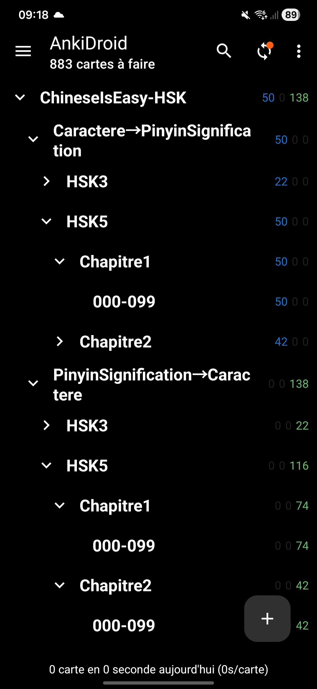
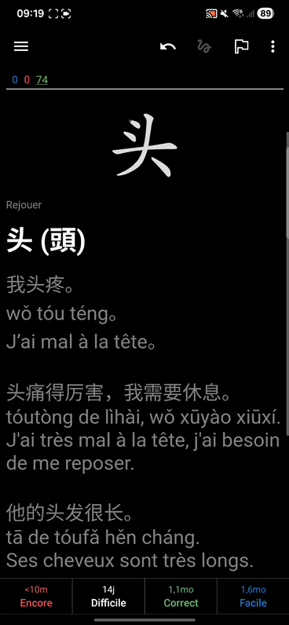

# 🐉 ChineseIsEasy – HSKWords

[](./../LICENSE)
[](https://github.com/AxelDlv00/ChineseIsEasy)

This repository is part of the **ChineseIsEasy** project — a collection of tools designed to make learning Mandarin more structured and interactive.
It focuses on generating an **Anki deck of HSK vocabulary**, enriched with contextual examples, Pinyin, French meanings, and animated stroke order.

> ⚠️ It does not contain the whole HSK vocabulary as I update it manually as I progress in my studies.

## Table of Contents

- [🐉 ChineseIsEasy – HSKWords](#-chineseiseasy--hskwords)
  - [Table of Contents](#table-of-contents)
  - [Overview](#overview)
  - [Usage (if you don't want to run the code yourself)](#usage-if-you-dont-want-to-run-the-code-yourself)
  - [Required Setup (if you want to run it yourself)](#required-setup-if-you-want-to-run-it-yourself)
    - [Folder structure](#folder-structure)
    - [Python Environment](#python-environment)
    - [Data Preparation](#data-preparation)
  - [License](#license)
  - [Author](#author)

## Overview

`HSKWords` automatically builds an **interactive Anki package (`ChineseIsEasy-HSK.apkg`)** that groups Chinese words by **HSK level and chapter**.


<p align="center">
  
  
</p>

Each card includes:

* Simplified and Traditional forms
* Pinyin with tone marks (auto-generated if missing)
* Short French meaning
* Example sentences in Chinese, Pinyin, and French
* Animated stroke order (via HanziWriter)

It uses existing data from `AnkiWords` to enrich the official HSK lists. Therefore, you need to verify that the `AnkiWords/generated_data/words_with_categories.parquet` file is up to date before running the script.

## Usage (if you don't want to run the code yourself)

You can directly use the [Anki deck file](https://github.com/AxelDlv00/ChineseIsEasy/releases/tag/v1.3) generated with this tool — **no coding required**.

1. **Install [Anki](https://apps.ankiweb.net/)** (available on Windows, macOS, and Linux). On android/IOS there is also AnkiDroid/AnkiMobile apps.
2. Download the file [`ChineseIsEasy-HSK.apkg`](https://github.com/AxelDlv00/ChineseIsEasy/releases/tag/v1.3).
3. In Anki, go to **File → Import...** and select the `.apkg` file.

Once imported, you can immediately start reviewing and customizing the deck to your study style.

## Required Setup (if you want to run it yourself)

### Folder structure

```
ChineseIsEasy-HSKWords/
├── data/
│   ├── hsk3.csv
│   ├── hsk5.csv
├── ../AnkiWords/
│   ├── generated_data/words_with_categories.parquet
│   ├── data/media/
│   │   ├── data/*.json        # Hanzi strokes
│   │   ├── FZKai.ttf          # Chinese font
│   │   └── hanzi-writer.min.js
└── HSKWordsGenerator.ipynb   
```

### Python Environment

You only need a few dependencies:

```bash
pip install pandas genanki pypinyin pyarrow fastparquet
```

### Data Preparation

The data used for the HSK vocabulary is stored in the `data/` folder: right now it includes `hsk3.csv` and `hsk5.csv`, which are not complete HSK lists but the words I have studied so far.

## License

Released under the [**MIT License**](./../LICENSE).
Free for educational, research, and personal use.

## Author

**Axel Delaval (陈安思)**