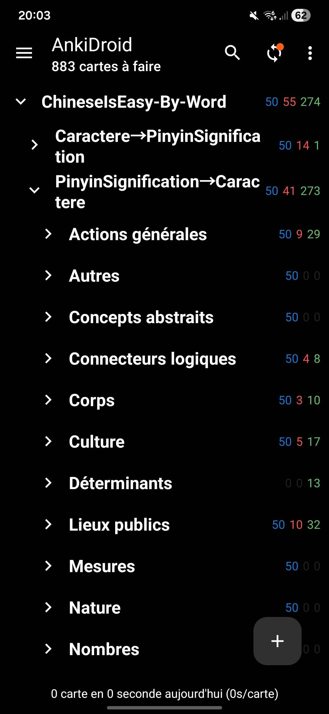
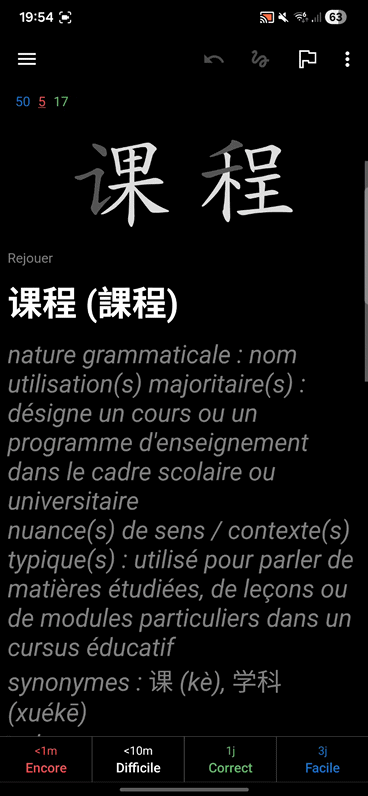

# 🐉 ChineseIsEasy – AnkiWords

[](./../LICENSE)
[](https://github.com/AxelDlv00/ChineseIsEasy)

I’m a French learner of Mandarin. To make my study sessions more efficient, I built several small tools under the umbrella project **ChineseIsEasy**.
This repository focuses on generating **structured Chinese vocabulary cards for Anki**, complete with pronunciation, explanations, examples, and stroke animations.

## Table of Contents

- [🐉 ChineseIsEasy – AnkiWords](#-chineseiseasy--ankiwords)
  - [Table of Contents](#table-of-contents)
  - [Overview](#overview)
  - [Usage (if you don't want to run the code yourself)](#usage-if-you-dont-want-to-run-the-code-yourself)
  - [Required Setup (if you want to run it yourself)](#required-setup-if-you-want-to-run-it-yourself)
    - [Python Environment](#python-environment)
    - [Dataset and Prompts](#dataset-and-prompts)
  - [License](#license)
  - [Author](#author)


## Overview

`ChineseIsEasy–AnkiWords` automatically creates **interactive Chinese vocabulary decks** for Anki （designed for French speaking learners, but the code can easily be adapted for other languages） using data from **SUBTLEX-CH** and **CCCEDICT**, combined with GPT-based semantic generation.

## Usage (if you don't want to run the code yourself)

You can directly use the [Anki deck file](https://github.com/AxelDlv00/ChineseIsEasy/releases/tag/v1.3) generated with this tool — **no coding required**.

1. **Install [Anki](https://apps.ankiweb.net/)** (available on Windows, macOS, and Linux). On android/IOS there is also AnkiDroid/AnkiMobile apps.
2. Download the file [`ChineseIsEasy-WordsByFrequency.apkg`](https://github.com/AxelDlv00/ChineseIsEasy/releases/tag/v1.3).
3. In Anki, go to **File → Import...** and select the `.apkg` file.

The deck contains **15,000 of the most frequent Chinese words**, each with:

* Simplified and Traditional forms
* Pinyin with tone marks
* Short French explanation
* Example sentence
* Animated stroke order

Once imported, you can immediately start reviewing and customizing the deck to your study style.

<p align="center">
 
 </p> 
<p align="center">
<em>Left: deck organized by category — Right: sample card with stroke animation</em></p>

## Required Setup (if you want to run it yourself)

It includes two main notebooks:

| Notebook                   | Description                                                                                     |
| -------------------------- | ----------------------------------------------------------------------------------------------- |
| `FullBatchGenerator.ipynb` | Uses GPT-4o-mini to generate word *categories*, *examples*, and *explanations* in batches       |
| `anki_words.ipynb`         | Converts the processed data into Anki `.apkg` decks with stroke animations and custom templates |

This project is designed for **language learners** who want to build a clean, well-structured, and visually rich Anki database for Mandarin.

### Python Environment

You only need standard data science and OpenAI packages:

```bash
pip install pandas openai pycccedict genanki
```

### Dataset and Prompts

Prepare the following folders and files:

```
ChineseIsEasy-AnkiWords/
├── data/
│   ├── SUBTLEX-CH-WF.xlsx          # Frequency list of Chinese words
│   └── media/                      # Contains font + stroke data
│       ├── FZKai.ttf
│       ├── hanzi-writer.min.js
│       └── *.json  (one per character)
├── prompts/
│   ├── prompt_categorie.txt
│   ├── prompt_exemples.txt
│   └── prompt_explications.txt
├── secrets/
│   └── api_key.txt
```

Your OpenAI API key must be stored in `secrets/api_key.txt`.

For instance: 
- The frequency dataset [SUBTLEX-CH](https://openlexicon.fr/datasets-info/SUBTLEX-CH/README-subtlex-ch.html) can be downloaded from the official site. 
- The JavaScript for stroke animations can be found on the [Hanzi Writer GitHub](https://github.com/chanind/hanzi-writer).
- The FZKai font is freely available [online](https://chinesefonts.org/fonts/fzkai-z03-regular).
  
## License

Released under the **MIT License**.
Free for educational, research, and personal use.
## Author

**Axel Delaval (陈安思)**
