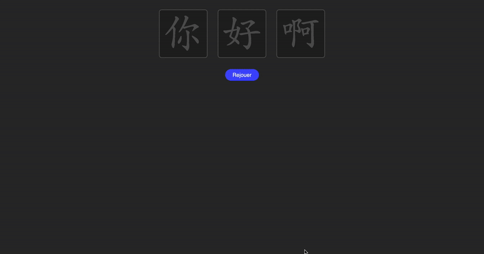

# README — Minimal Anki Deck with Shared HanziWriter JavaScript

[](../LICENSE)
[](https://github.com/AxelDlv00/ChineseIsEasy)

## Goal

Earlier versions of *ChineseIsEasy* embedded HanziWriter code directly inside each Anki card.
This duplicated large amounts of JavaScript and caused unnecessary memory use.

An Anki `.apkg` acts like a `.zip` archive and can include shared media files through `package.media_files`.
This makes it possible to load JavaScript once and reuse it across all cards.

This example shows how to display stroke-order animations for the characters `一, 二, 三` using a clean, maintainable approach with shared JavaScript.

(Note: On macOS, JavaScript logs are visible by launching Anki from the terminal:
`/Applications/Anki.app/Contents/MacOS/launcher`.)

<p align="center">
  
</p>

## Problems with earlier approaches

### 1. Embedding minified JS directly in Anki templates

Placing large minified code inside:

```html
<script>
  ... minified HanziWriter code ...
</script>
```

caused Anki to wrap and re-parse it inside an internal `legacyPageData` block, often producing:

```
SyntaxError: Unexpected end of input
```

The script did not execute even though the tag was present.

### 2. Dynamic script loaders

Loading scripts via `loadScript()` or dynamically created `<script>` tags caused inconsistent behavior:

* scripts loaded multiple times
* caching issues
* unpredictable execution order (desktop vs mobile)

This resulted in errors like:

* `initHanziWriter is not defined`
* `Identifier has already been declared`

### 3. Many problems of cache 

When generating new cards, the shared `media` folder is not cleared by Anki, therefore I often did not understand some behaviors because old versions of JS files were still there under the same name.

## Adopted solution

1. Load the official HanziWriter library as a standard media file:

```html
<script src="_hanzi-writer.min.js"></script>
```

This avoids the parsing issues and ensures reliable execution.

2. Place all shared logic in a single file `_shared_hanzi.js`, included once in the media folder.
   This file contains:

* the JSON loader override:

```js
HanziWriter.loadCharacterData = function(char) { ... }
```

* a global initializer:

```js
window.initHanziWriter = function(char) { ... }
```

Each card template then only needs:

```html
<script>
  initHanziWriter("{{char}}");
</script>
```

This provides a minimal template with no duplicated JavaScript and predictable behavior across all platforms.

# License

Released under the [**MIT License**](../LICENSE).  
Free for educational, research, and personal use.

# Author

**Axel Delaval (陈安思)**