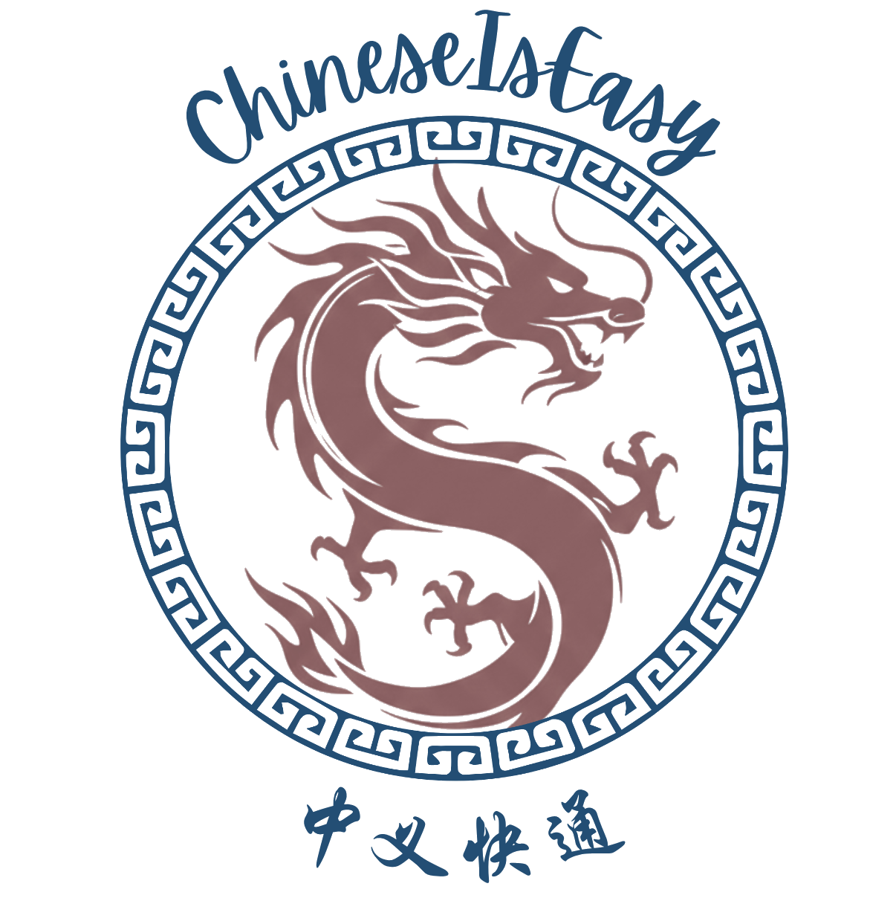
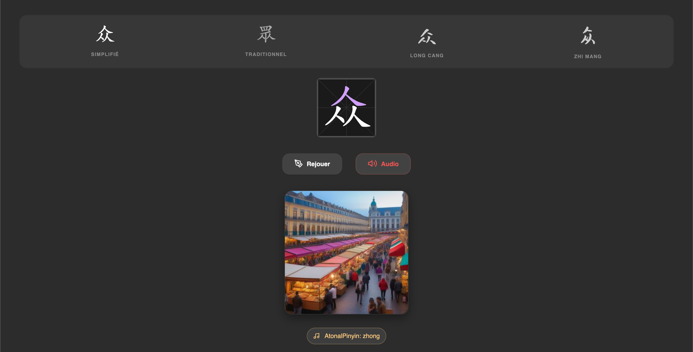
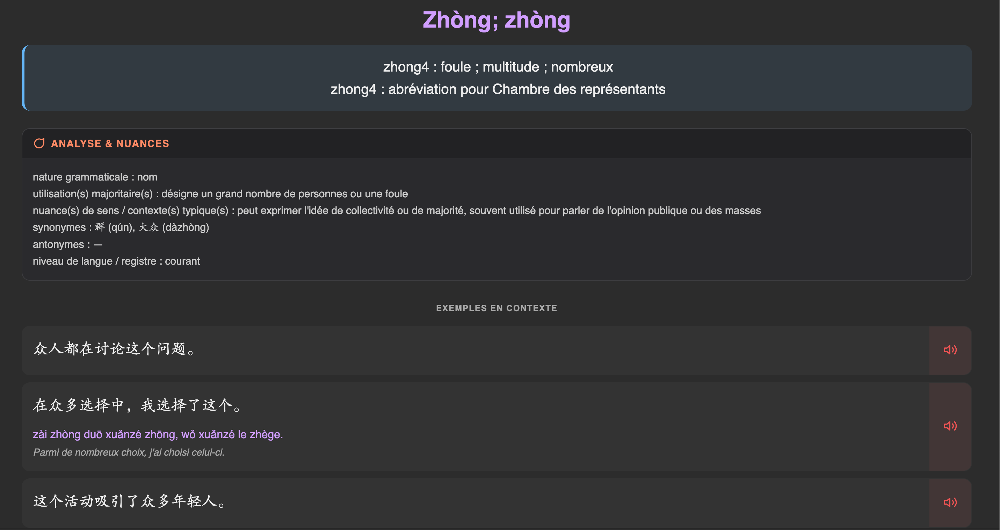

<div align="center">
  
  
  **🐉 ChineseIsEasy**
    
  *[Axel Delaval (陈安思)](https://axeldlv00.github.io/axel-delaval-personal-page/) • 30 January 2026*
  <br />
  [](https://github.com/AxelDlv00/ChineseIsEasy)
[](./LICENSE) [](https://huggingface.co/datasets/AxelDlv00/ChineseIsEasy)
<br />
**Other projects in the ChineseIsEasy ecosystem:**

[](https://github.com/AxelDlv00/GeoChina)
[](https://github.com/AxelDlv00/ChineseIsEasy-Calligraphy)

</div>

# 🐉 ChineseIsEasy — Tools to Learn Chinese Efficiently (v3.0)

**ChineseIsEasy** is a collection of tools I built to study Mandarin efficiently as a French learner.
It provides:

* generators for **high-quality Anki decks** (Vocabulary, Poems, Idioms)
* French-oriented explanations & examples
* **stroke-order animations**, **audio**, **semantic images**
* a unified, mobile-safe **HanziWriter engine**
* clean templates that work identically on Desktop, AnkiDroid, and AnkiMobile

Everything is open, reproducible, and designed for long-term learning.

<div align="center">
  

**Figure 1** : Recto-Verso example of vocabulary cards with audio, images, explanations, and examples.
</div>

## ✨ What's New in v3.0 

Compared to v2.2, the code has been **refactored** and **modularized** for better maintainability and extensibility. Instead of notebooks for each deck type, there is now a unified `anki_generator.py` script with configuration files for each deck.

The dataset has also been **updated** and better formatted in HuggingFace. 

The appearance of the cards has been slightly improved, using a more modern font and cleaner layout, through a shared CSS file. Moreover, individual words now use `gtts` audio again (instead of `百度` API) even if it is less natural, because for short samples, the tone pronunciation were sometimes unreliable. 

## How to Use (No programming skills required)

1. Install [Anki](https://apps.ankiweb.net/) on your computer and [AnkiDroid](https://play.google.com/store/apps/details?id=com.ichi2.anki) on your mobile device.
2. Go to our [Realese Page](https://github.com/AxelDlv00/ChineseIsEasy/releases) and download the latest pre-generated Anki decks (in `.apkg` format).
3. In Anki Desktop, go to `File -> Import` and select the downloaded `.apkg` file to import the deck.

You are done ! 

> ⚠️ Note : The default settings automatically play all audio in the cards, which is anoying in our case. To disable this, go to `Preferences → Audio → Don't automatically play audio`

## Repo Structure (If you want to dig into the code)

The code files in `src/` are organized as follows:

```bash
├── anki_generator.py <-- Unified Anki Deck Generator
├── config.json
├── display.py
├── generate_audio.py
├── generate_image.py
├── generate_text.py
├── prompt_manager.py
└── prompts
```

The `generate*.py` files contain modular functions for generating audio, images, and text content. They might need to be adapted for each use case. 

The `prompt*` files and folders contain the logic for prompt management and LLM interaction, through OpenAI API.

The `config.json` file contains the configuration for the deck to be generated (fields, layout, grouping, filters, etc.)

The `anki_generator.py` file is the main script that ties everything together and generates the Anki deck based on the configuration and dataset. 

> Note : If you use this code, some of the files (mostly the shared JS and CSS files for Anki) are extracted from our [HuggingFace Repo](https://huggingface.co/datasets/AxelDlv00/ChineseIsEasy). 

## Weekly Personal Lists

If you already imported and synced the full `ChineseIsEasy::Dictionary` deck in Anki, you can build small media-free personal decks without loading the Hugging Face dataset again.

`src/make_mylist_apkg.py` reads your local synced Anki collection, copies the existing ChineseIsEasy note fields for the requested words, and exports a tiny deck under `MyLists/<name>/<name>.apkg`.

Example:

```bash
python src/make_mylist_apkg.py --file MyLists/week-2026-06-03
```

With inline words:

```bash
python src/make_mylist_apkg.py week-2026-06-03 理解 背诵 有用 语言 方式 思考 千万 犯错
```

On macOS, Anki profiles are usually stored under `~/Library/Application Support/Anki2/<profile>/collection.anki2`, not `/Library/Application Support`. The script auto-selects the `ChineseIsEasy` profile when it exists. You can also pass the collection explicitly:

```bash
python src/make_mylist_apkg.py week-2026-06-03 --collection "$HOME/Library/Application Support/Anki2/ChineseIsEasy/collection.anki2" 理解 背诵
```

The generated APKG intentionally contains no media files. It keeps references like `[sound:...]` and ``, so audio and images work only in Anki collections where the original ChineseIsEasy media has already been synced.

If some words are missing from your local Anki collection, the script still exports the cards it found and prints the missing list. Use the `mylist_fallback_csv` prompt in `src/prompts/catalog.yaml` with those missing words, then save the AI output next to the list with the same name and a `.csv` extension:

```bash
MyLists/week-2026-06-03
MyLists/week-2026-06-03.csv
```

Run the same command again. The script automatically loads the sibling CSV and creates fallback cards for the missing words. The CSV must use semicolon separators and quoted fields:

```csv
"Word";"Traditional";"Pinyin";"Meaning";"Explanation";"Examples";"Category";"Frequency";"Image";"Audio"
```

You can also paste CSV rows directly into the word-list file. Plain lines are treated as words; semicolon CSV lines are treated as full fallback card rows.

For fallback CSV rows, `Examples` should contain the JSON format produced by the `mylist_fallback_csv` prompt. The script converts that JSON into the same clickable example HTML used by Dictionary cards. Older fallback rows that contain AI-generated `sentence-container` HTML are repaired automatically when possible.

AnkiWeb cannot be used as a remote card or media server from inside an APKG. This script uses your local Anki collection as the source of truth instead.

## Generation Pipeline

1. **Linguistic Enrichment:** Batch processing via **GPT-4o-mini** for pedagogical categories and grammatical explanations.
2. **Visual Semantics:**
* LLM-driven prompt engineering.
* Local generation using [`Juggernaut XL v9`](https://huggingface.co/RunDiffusion/Juggernaut-XL-v9) (SDXL) to create high-quality semantic anchors.


3. **Audio Strategy:**
* **Words:** Human recordings (CC-CEDICT-TTS) supplemented by gTTS fallbacks.
* **Sentences:** Synthesized using [`voxcpm`](https://huggingface.co/openbmb/VoxCPM-0.5B) with voice cloning from the [`ST-CMDS-20170001_1-OS`](https://openslr.trmal.net/resources/38/ST-CMDS-20170001_1-OS.tar.gz) corpus for natural diversity.

## ⚖️ License

* **Dataset Content:** Released under **CC BY 4.0**.
* **Lexical Base:** Derived from [`CC-CEDICT`](https://pypi.org/project/pycccedict/).
* **Frequency Stats:** Based on the [`SUBTLEX-CH`](https://openlexicon.fr/datasets-info/SUBTLEX-CH/README-subtlex-ch.html) corpus.
* Fonts used specify their own licenses in the `OFL.txt` files.

## Author

**Axel Delaval (陈安思)**
